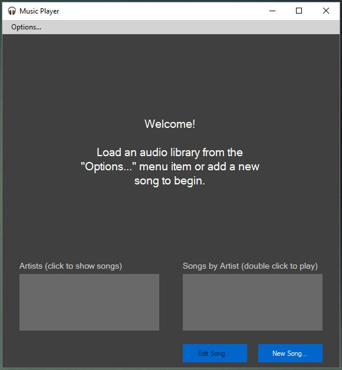
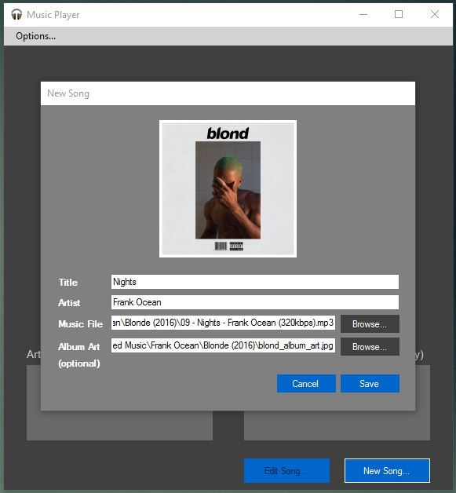
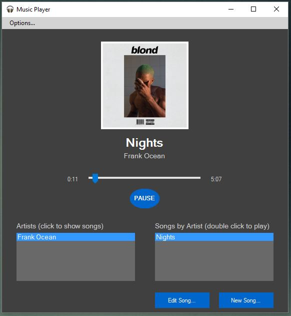

# Windows Forms Music Player (C#.NET 4.5.2)
### Derek Plautz

Created for a C# course at Ohio State. This program is a simple music player that plays `mp3` and `wav` music files. The application perserves data state by reading/writing `.audio` files. A file can have any amount of artists and each artist can have any amount of songs. Each song has a title, artist, and music file. Additionally, an album artwork image can be attached to each song.

Audio is played using the [NAudio](https://naudio.codeplex.com/) .NET library.

### Screenshots
---
**Welcome screen (some text is old)**

**Adding a new song**

**While a song is playing**

